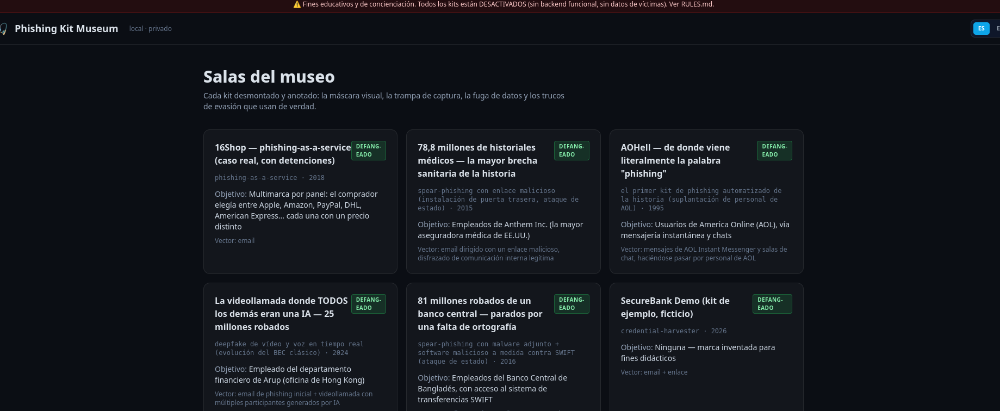

<div align="center">

# 🎣 PHISHING KIT MUSEUM 🎣

### Museo interactivo de ingeniería social — 30 casos reales, de 1989 a 2024

**🇪🇸 Español**  ·  [🇬🇧 English](README.en.md)


<br>



<sub>El catálogo de salas — cada una con su vector, objetivo y estado "defang-eado"</sub>

</div>

---

> ⚠️ Fines educativos y de concienciación. Todos los kits están
> **desactivados**: sin backend funcional real, sin datos de víctimas,
> ninguna llamada de red sale nunca de tu propia máquina. Ver
> [RULES.md](RULES.md).

## 🧬 Qué es esto

Un museo local donde cada sala **desmonta un caso real y documentado** de
phishing/ingeniería social — con su fuente citada (FBI, Group-IB, Krebs,
Departamento de Justicia de EE.UU...), su mecanismo técnico explicado, y
**código que puedes ejecutar de verdad en tu máquina** con un solo botón.

No son capturas de pantalla. No son resúmenes. Es el flujo completo
funcionando — formularios que capturan, filtros anti-bot que bloquean de
verdad, un proxy que intercepta una sesión — con el "robo" quedando
siempre en un archivo de texto local, nunca en internet.

## ⚡ Capacidades

| Módulo | Descripción |
|--------|-------------|
| 🏛️ **30 salas documentadas** | De AOHell (1995, origen de la palabra "phishing") al deepfake de vídeo en tiempo real (2024). Cada una con fuente citada. |
| 🚀 **Botón "Levantar sala"** | Arranca un servidor PHP real, solo en `127.0.0.1`, y abre la pestaña sola — sin tocar la terminal. |
| 🔐 **Defang por diseño** | Cero llamadas a dominios externos reales en las 30 salas (auditado). El "robo" se queda en un log local, nunca sale de tu disco. |
| 🌐 **Bilingüe ES/EN** | Interfaz y las 30 disecciones técnicas completas en ambos idiomas, con conmutador en la propia web. |

## 🗺️ Las 30 salas

| Sala | Año | Fuente |
|------|:---:|--------|
| Fraude 419 | 1989 | histórico (timo del prisionero español) |
| AOHell — origen de "phishing" | 1995 | Rekouche (arXiv) |
| Operation Phish Phry (100 acusados) | 2009 | FBI |
| RSA SecurID | 2011 | Threatpost |
| $100M a Google/Facebook | 2013 | DOJ |
| Target / Fazio (HVAC) | 2013 | Krebs |
| Phish in a Barrel | 2014 | Duo Security |
| Sony Pictures | 2014 | RSA Conference |
| Ubiquiti BEC ($46,7M) | 2015 | Krebs |
| Anthem (78,8M registros) | 2015 | DOJ |
| Bangladesh Bank ($81M) | 2016 | CSO Online |
| Podesta / DNC 2016 | 2016 | SecureWorks |
| W-2 tax phishing | 2016 | IRS |
| Google Docs OAuth worm | 2017 | Netskope |
| 16Shop (con detenciones) | 2018 | Trend Micro / Interpol |
| MyEtherWallet (BGP hijack) | 2018 | BleepingComputer |
| Reddit (SIM swap) | 2018 | Krebs |
| Twitter VIP (vishing) | 2020 | NY DFS |
| LogoKit | 2021 | RiskIQ / Microsoft |
| 0ktapus (smishing) | 2022 | Group-IB |
| Ronin / Axie ($625M) | 2022 | Chainalysis |
| Uber (fatiga MFA) | 2022 | Dark Reading |
| Antibot + Telegram | 2022 | SiteLock |
| W3LL / OV6 (bypass MFA) | 2023 | Group-IB / FBI |
| MGM / Scattered Spider | 2023 | Specops |
| Quishing (QR) | 2023 | FBI IC3 |
| Pig Butchering | 2023 | US Secret Service |
| Soporte técnico falso | 2023 | FBI / FTC |
| Arup (deepfake, $25M) | 2024 | Policía Hong Kong |
| SecureBank Demo | — | plantilla del proyecto |

## 🚀 Arranque

```bash
cd app
python3 indexer.py     # genera el índice desde kits/
python3 server.py      # ▶ http://127.0.0.1:5058
```

Dentro de cada sala, el botón **🚀 Levantar sala** arranca el PHP real —
o hazlo tú a mano, ver [HOW_TO_RUN_LOCALLY.md](HOW_TO_RUN_LOCALLY.md).

## 🗺️ Estructura

```
Phishing Kit Museum/
├── RULES.md                 # reglas no negociables (léelo primero)
├── HOW_TO_RUN_LOCALLY.md
├── kits/<sala>/
│   ├── meta.json            # ficha (ES/EN), puerto local, fuente
│   ├── annotations.md / _en.md
│   └── original/            # código real, defang-eado
└── app/                      # motor Flask (indexer, server, i18n)
```

## 🧾 Procedencia

Cada sala reconstruye un mecanismo **documentado públicamente** por
investigadores o autoridades — nunca copia un kit robado ni datos de
víctimas reales. Ver la fuente citada en cada `meta.json`.

---

<div align="center">

### ⚖️ AVISO LEGAL

**Uso exclusivamente educativo y de investigación en ciberseguridad.**
Ningún kit de este museo tiene backend funcional contra un objetivo real.

☣️

</div>
